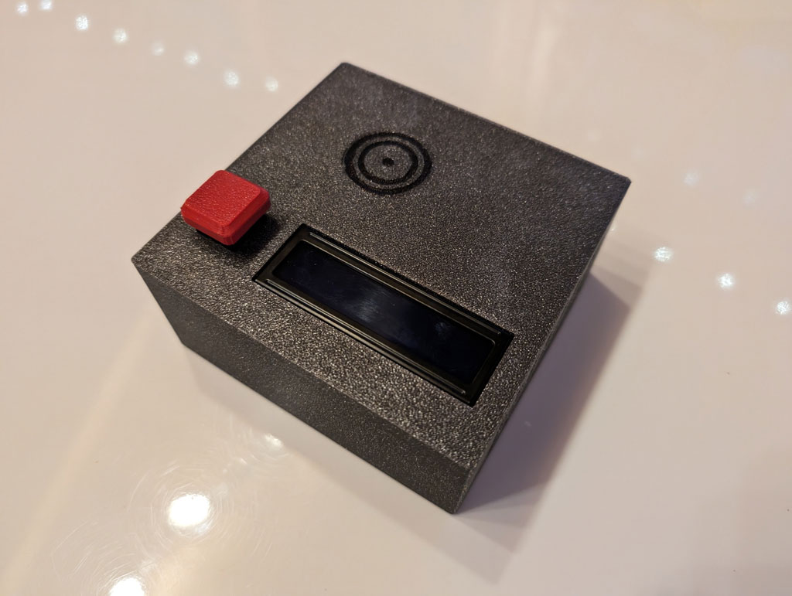

# Simplicity-Player
This project was born out of a personal motivation: I wanted to bring joy and
comfort to my grandmother, who, due to her visual impairment, can no longer
enjoy reading – one of her lifelong passions. To make her daily life more
enjoyable and to make accessing audiobooks as easy as possible for her, I
developed the SimplicityPlayer.

  
The SimplicityPlayer is a user-friendly audiobook player explicitly designed to
allow people with visual impairments to operate it easily. It utilizes a
physical button for play/pause and provides feedback through a simple LCD, which
is optional for operation. To change the audiobook, it uses RFID cards, which
only need to be placed on the reader.  
  
This project also marks my entry into the world of Python programming. With
little prior experience in Python, it was a challenge, yet it was gratifying
because I had the explicit goal of creating something meaningful for my
grandmother. Throughout the development process, I learned a lot about Python,
hardware interactions on the Raspberry Pi, and managing audio media.  
  
## Features
- **Easy Operation:** The player is controlled using a physical button and RFID
cards, making it easy to use even for individuals with visual impairments.
- **Feedback via LCD:** A simple LCD provides visual feedback designed for high
contrast and easy readability.
- **Customizable and Expandable:** Using a Raspberry Pi as the base, the player
can easily customize and extend with additional features.
- **Web Interface:** A simple web interface allows for remote player control and
audio media management.

## Hardware
- 1x Raspberry Pi 3A+
- 1x InnoMaker HiFi DAC HAT (RPI-HIFI-DAC-PCM5122)
- 1x RFID Reader (RC522)
- 1x LCD1602 + LCD I2C Interface (PCF8574)
- 1x Cherry MX Button
- 1x 4k7 Ohm Resistor
- 4x M2.5x5
- 7x M3x6
- 4x M3 nuts (optional, could be also printed)
- some wires and shrink tubes
- 2x 4-pin female Dupont connectors (optional, could be also soldered)
- 1x 3-pin female Dupont connector (optional, could be also soldered)
- 1x 2-pin female Dupont connector (optional, could be also soldered)
- 1x 2-pin male Dupont connector (optional, could be also soldered)
- 13x female Dupont crimps (optional, could be also soldered)
- 2x male Dupont crimps (optional, could be also soldered)
- Filament for 3D printing (I used ABS, all other filament types should work as
well)

## Wiring
The wiring guide can be found in this repository's `docs/WIRING.md` file.

## Installation
The installation guide can be found in this repository's `INSTALL.md` file.

### Contribution
Your contribution to this project is warmly welcomed! Whether you want to
contribute code, report bugs, or suggest improvements, every bit of help is
valuable in making the SimplicityPlayer better and more accessible to everyone.
Please see the `CONTRIBUTING.md` file for more information.  
  
I hope the SimplicityPlayer brings you or your loved ones as joy as it has
brought my grandmother and me.