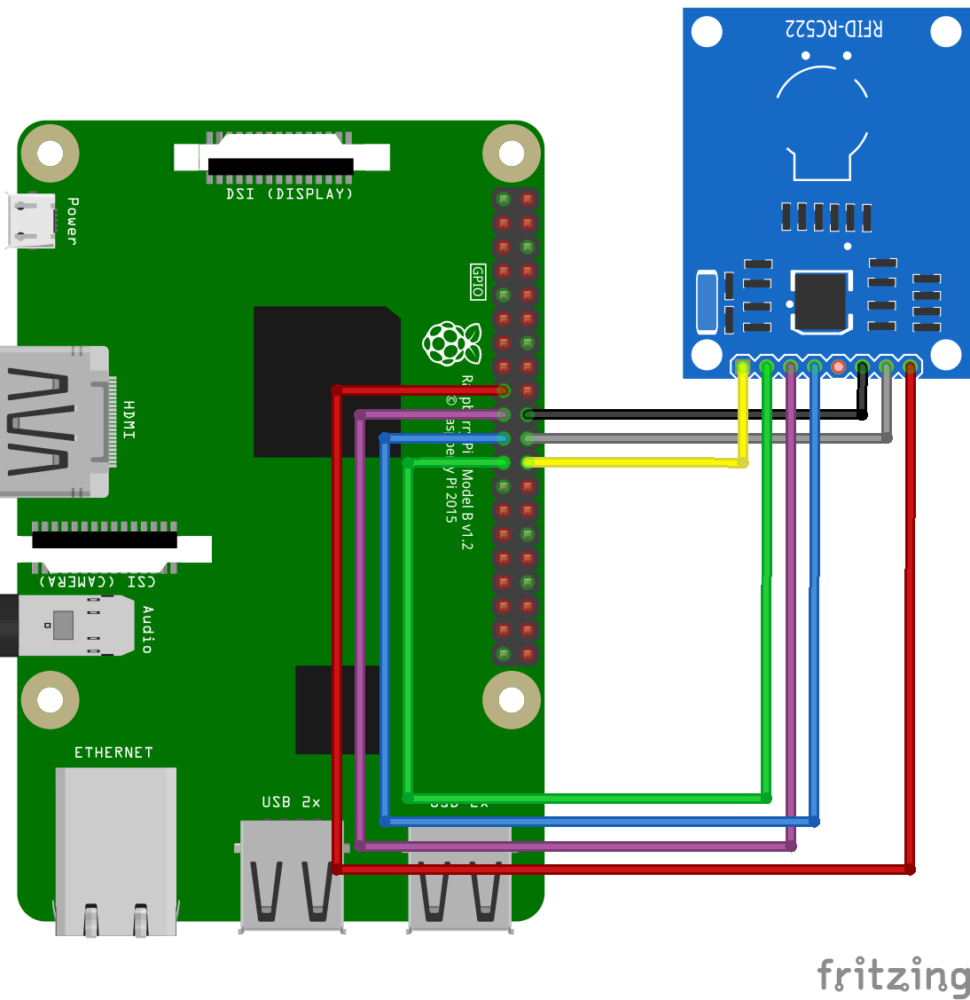
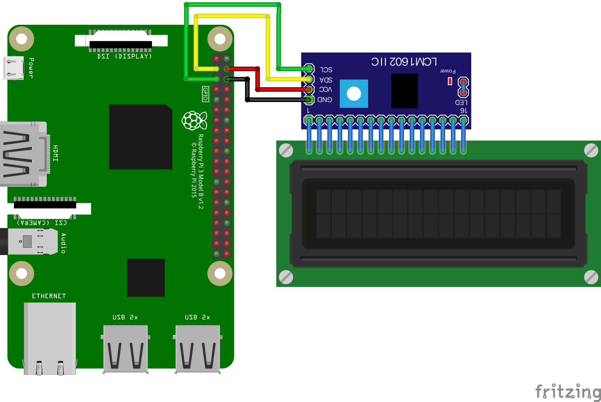
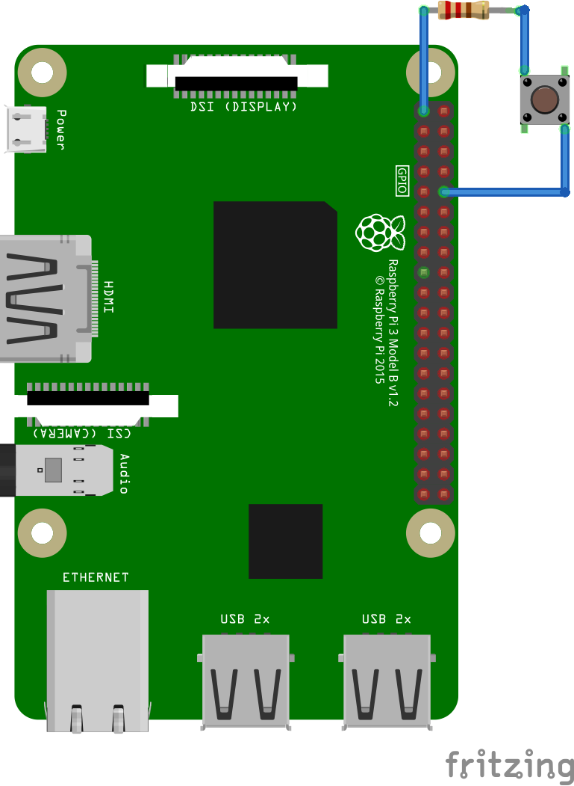
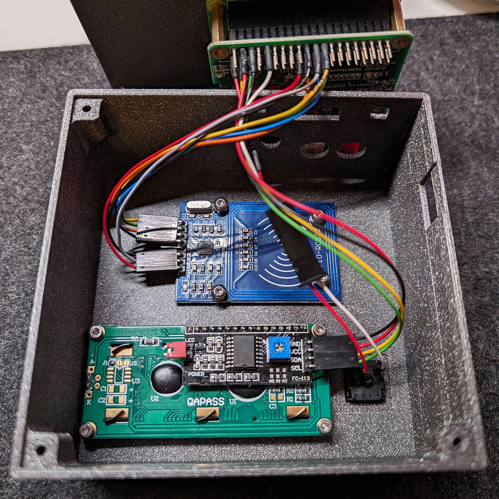

# Wiring for the SimplicityPlayer
This guide will help you wire the components of the SimplicityPlayer. The wiring
is relatively simple and requires only a few components. The wiring guide is
split into three parts: the wiring of the Raspberry Pi with the RFID reader, the
wiring of the Raspberry Pi with the LCD, and the wiring of the Raspberry Pi with
the button.  
I soldered the wires directly onto the HiFi DAC HAT, but you can also use Dupont
connectors to connect the components, but in my case the Dupont connectors were
too loose and I had to solder the wires directly onto the HiFi DAC HAT.  
  
Because the HiFi DAC HAT is not a standard component, there is no image for this
component in the Fritzing library. I used the Raspberry Pi 3B as a placeholder.

## Wiring the Raspberry Pi with the RFID Reader
The RFID reader is connected to the Raspberry Pi using the SPI interface. The
wiring is as follows:

## Wiring the Raspberry Pi with the LCD
The LCD is connected to the Raspberry Pi using the I2C interface. The wiring is
as follows:

## Wiring the Raspberry Pi with the Button
The button is connected to the Raspberry Pi using a GPIO pin and a pull-up
Resistor. The wiring is as follows:

(There was no cherry MX button in the Fritzing library, so I used a normal
button and I don't know how to change the resistor value in Fritzing, so I used
a default 220 Ohm resistor instead of the 4k7 Ohm resistor)

## Final Wiring
After wiring all components, the final wiring should look like this:
